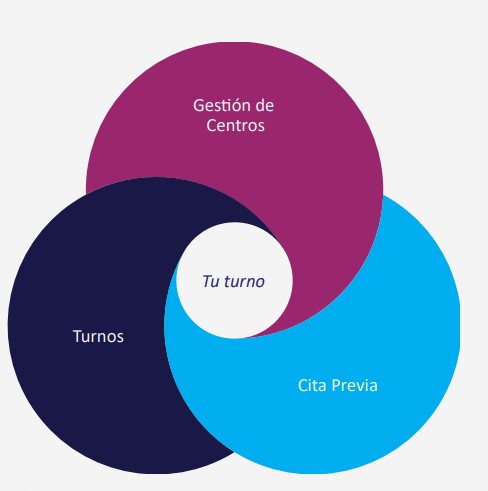
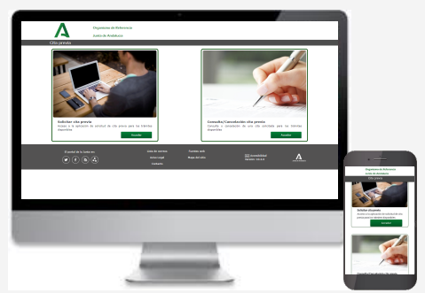
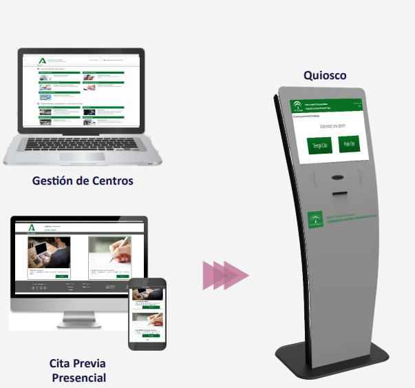
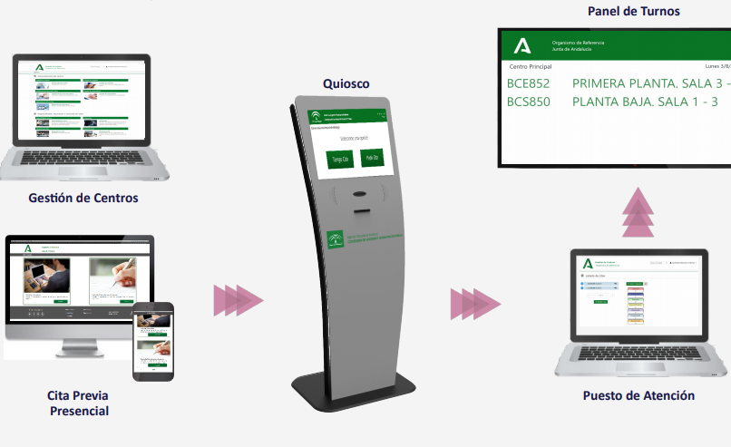

# Portada
## ${titulo-presentacion}
Tu Turno
## ${subtitulo-presentacion}
Sistema de gestión de citas previas de la Junta de Andalucía
# Índice
## ${contenido-textual}
1. Introducción al sistema  
2. Objetivos y beneficios  
3. Arquitectura y componentes  
4. Flujo de funcionamiento  
5. Integraciones y seguridad  
6. Resultados y próximos pasos

# 1. Introducción al sistema
## ${titulo-diapositiva}
1. Introducción al sistema
## ${contenido-textual}
El sistema Tu Turno está formado por varias aplicaciones, que permitirán realizar todo el proceso de gestión de citas:

- Gestión de Centros: Permitirá administrar los distintos centros, servicios y áreas para los cuales se podrán solicitar cita, así como los usuarios y mostradores en los que se atenderán.
- Cita Previa: Permitirá solicitar cita para el servicio que se desee, eligiendo el día y la hora que mejor convenga, así como cancelar o consultar citas.
- Panel de Turnos: Permitirá ver en pantalla las citas llamadas por un agente, indicando la ventanilla y el lugar donde se encuentra el mostrador correspondiente.
## ${imagen}

# 2. Objetivos y beneficios
## ${titulo-diapositiva}
2. Objetivos y beneficios
## ${contenido-textual}
**Objetivos principales:**
- Optimizar la atención al ciudadano reduciendo tiempos de espera  
- Centralizar la gestión de citas de todos los organismos  
- Mejorar la planificación de recursos administrativos  

**Beneficios:**
- Experiencia más ágil y cómoda para el usuario  
- Mayor control para los gestores  
- Disminución de colas y esperas en oficinas públicas  
## ${imagen}

# 3. Arquitectura y componentes

## ${titulo-diapositiva}
3. Arquitectura y componentes
## ${contenido-textual}
El sistema Tu Turno se compone de varios módulos integrados:

- **Frontend:** Aplicaciones web y móvil adaptadas al ciudadano  
- **Backend:** Servicios REST y APIs centralizadas de gestión  
- **Base de datos:** Registro unificado de citas y usuarios  
- **Integraciones:** Con sistemas de identidad y agenda corporativa  

La arquitectura sigue un enfoque modular y escalable, basado en microservicios.  
## ${imagen}

# 4. Flujo de funcionamiento

## ${titulo-diapositiva}
4. Flujo de funcionamiento
## ${contenido-textual}
1. El ciudadano accede al portal o app móvil  
2. Selecciona el servicio y oficina deseada  
3. Consulta la disponibilidad y elige fecha y hora  
4. Recibe confirmación y recordatorios automáticos  
5. El gestor puede visualizar y gestionar las citas desde el panel interno  

El flujo se diseña para minimizar errores y facilitar la experiencia.  
## ${imagen}

# 5. Resultados y próximos pasos

## ${titulo-diapositiva}
5. Conclusiones y próximos pasos
## ${contenido-textual}
**Resultados alcanzados:**
- Miles de citas gestionadas con eficiencia  
- Reducción media del tiempo de espera en un 40%  
- Mayor satisfacción ciudadana registrada en encuestas  

**Próximos pasos:**
- Informe sobre la atención prestada en CEIS a las incidencias de Tu Turno.
- Incorporar código QR para presentación contactless en el quiosco.
- Adaptar el sistema de citas por videoconferencia para que la autenticación del ciudadano tenga validez jurídica.
## ${imagen}

